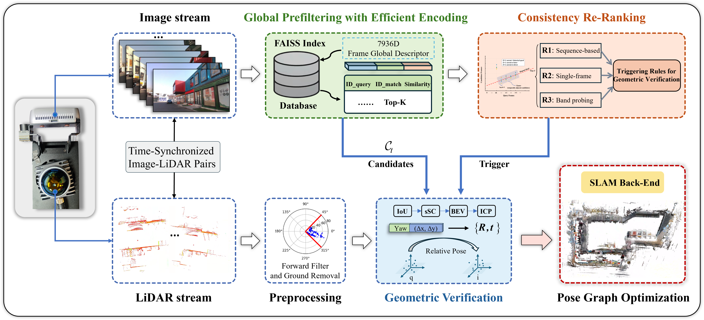

# GPGV-FusionLCD

## GPGV-FusionLCD: Visual-Lidar Fusion Loop Closure Detection for Multi-Sensor SLAM

## Introduction

GPGV-FusionLCD is a cross-modal loop closure detection framework for multi-sensor SLAM that integrates codebook-free global visual prefiltering with efficient LiDAR geometric verification: a codebook-free global visual prefilter quickly narrows the candidate set, and a LiDAR geometric verifier is invoked only for the most promising candidates to produce high-confidence relative pose constraints for pose-graph optimization in Back End.

    

## Dataset
The KITTI dataset is publicly available from the official website https://www.cvlibs.net/datasets/kitti/.
